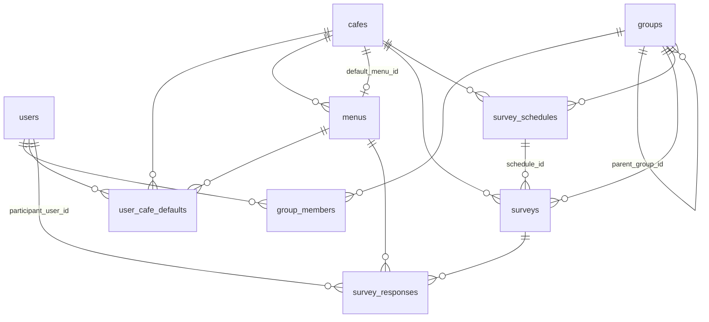

# 설계

> 도메인 규칙과 데이터 모델, 그리고 각 결정의 이유. 코드는 이 문서에 맞춰져 있다.
> 규칙을 바꾸려면 여기부터 고치고 코드를 따라오게 한다.

## 도메인 용어

| 용어 | 뜻 |
|---|---|
| 회원 (user) | 관리자가 이메일로 사전 등록한 사람. `invited`(미로그인) 또는 `active`(구글 계정 연결됨) |
| 그룹 (group) | 본부·팀 같은 조직 단위. 트리 구조 |
| 유효 멤버 | 어떤 그룹의 직속 멤버 ∪ 모든 하위 그룹 멤버 (중복 제거). 조사 대상이 되는 사람들 |
| 카페 / 메뉴 | 주문 대상. 메뉴는 기본가 + 옵션 그룹 JSON |
| 즐겨찾기 (user_cafe_default) | 사람 × 카페별 기본 음료 스냅샷 |
| 조사 (survey) | 특정 날짜·그룹·카페에 대한 주문 취합. `open` → `closed` |
| 응답 (survey_response) | 잔 하나. 본인 잔(participant_user_id) 또는 게스트 잔(guest_label) |
| 스케줄 (survey_schedule) | 매주 요일마다 조사를 자동 생성하는 규칙 |
| 주문서 (summary) | 조사의 집계 결과. 메뉴×옵션 조합별 수량 + 개인별 목록 + 복사용 텍스트 |

## 데이터 모델



DDL은 `app/schema.sql` 하나가 원본이다. 여기서는 제약이 담당하는 규칙만 적는다.

| 제약 | 담당 규칙 |
|---|---|
| `users.email UNIQUE`, `users.google_sub UNIQUE` | 이메일 1개 = 계정 1개. 구글 계정 1개 = 회원 1명 |
| `users.role CHECK`, `users.status CHECK`, `surveys.status CHECK` | 열거값 |
| `groups.name UNIQUE` | 그룹 이름 충돌 방지 |
| `groups.parent_group_id → groups(id)` (CASCADE 없음) | 하위 그룹이 있는 그룹은 삭제 불가 |
| `surveys.group_id`, `survey_schedules.group_id` FK (CASCADE 없음) | 조사·스케줄이 참조하는 그룹은 삭제 불가 |
| `group_members` ON DELETE CASCADE | 회원·그룹 삭제 시 소속 자동 정리 |
| `uq_surveys_schedule_date (schedule_id, survey_date) WHERE schedule_id IS NOT NULL` | 스케줄 자동 생성 멱등성 |
| `uq_responses_participant (survey_id, participant_user_id) WHERE participant_user_id IS NOT NULL` | 1인 1잔. 게스트 잔은 제한 없음 |
| `survey_responses CHECK (participant_user_id IS NOT NULL OR guest_label IS NOT NULL)` | 잔은 본인 잔이거나 게스트 잔 |

### 시간 문자열 규약

모든 시간은 **로컬 시간 문자열**. 타임존 없음. 서버 1대, 사용자 전원 같은 지역이라는 전제.

| 종류 | 형식 | 예 |
|---|---|---|
| 날짜 | `YYYY-MM-DD` | `2026-09-02` |
| 시각 | `HH:MM` | `10:30` |
| 마감 일시 `deadline_at` | `YYYY-MM-DD HH:MM` | `2026-09-02 10:30` |
| 기록 일시 `created_at` 등 | `YYYY-MM-DD HH:MM:SS` | SQLite `datetime('now','localtime')` |

같은 형식이면 문자열 비교가 시간 순서와 일치하므로 `deadline_at <= now` 를 SQL과 파이썬 양쪽에서 그대로 쓴다.
마감 판정은 **분 단위**(`now_min()`)로 한다. 초 단위 값과 비교하면 `10:30` ≤ `10:30:15`가 되어 의도와 어긋나기 때문.

## 핵심 규칙

### R1. 회원은 사전 등록, 계정은 최초 로그인 때 바인딩

```
관리자가 email·name 등록 ──▶ status=invited, google_sub=NULL
본인이 구글 로그인 ──▶ ① email_verified ② 도메인 검사 ③ email로 행 조회
                    ──▶ google_sub 바인딩 + status=active + name을 구글 프로필로 갱신
```

- 미등록 이메일 → 거절. 자기 가입 없음. **사전 등록 = 접근 허가.**
- 이미 바인딩된 행에 다른 `sub`가 오면 거절 → 이메일 재사용을 통한 계정 가로채기 방지.
- `active` 회원의 이메일은 관리자도 못 바꾼다(바인딩 키이므로). `invited` 상태에서는 수정 가능.
- `DEV_LOGIN=1`이면 등록된 이메일만 입력해 로그인하는 폼이 열린다. 이때도 `invited → active` 전환은 일어난다.

### R2. 그룹은 트리, 조사 대상은 유효 멤버

- `parent_group_id`가 NULL이면 최상위(본부). 깊이 제한 없음.
- 유효 멤버 = 재귀 CTE로 자기 자신 + 자손 그룹을 모은 뒤 `group_members`를 조인, `DISTINCT`.
- 홈에 보이는 조사 = 내가 직속 소속인 그룹 **및 그 조상 그룹**의 조사. 본부 조사도 내 대상이기 때문.
- 순환 금지: 그룹의 상위를 바꿀 때 새 상위가 자기 자신이나 자기 자손이면 거절.

### R3. 마감은 lazy, 자동 채택은 마감과 한 트랜잭션

```
접근 ──▶ UPDATE surveys SET status='closed' WHERE id=? AND status='open' AND deadline_at <= now
       ├─ rowcount=1 (내가 닫았다) ──▶ 자동 채택 실행
       └─ rowcount=0 (이미 닫혔거나 아직) ──▶ 아무것도 안 함
```

자동 채택 대상: 유효 멤버 중 **응답이 없고 `status='active'`인** 사람. 우선순위:

1. 그 카페의 내 즐겨찾기 (메뉴가 `is_active`일 때만)
2. 카페 공통 기본음료 `cafes.default_menu_id` (필수 옵션은 각 그룹의 첫 선택지)
3. 둘 다 없으면 **제외** (주문서에 "제외"로 표시)

`invited`(한 번도 로그인 안 한) 회원을 제외하는 이유: 그룹에 이름만 올라간 사람 몫까지 시켜버리는 사고 방지.

수동 마감(생성자·관리자)은 같은 함수에 `deadline_at` 조건만 뺀 것이다.

### R4. 스케줄은 lazy 생성, 놓친 주는 건너뜀

```
홈 접속 ──▶ 오늘 요일과 일치하는 enabled 스케줄마다
          ├─ 오늘 마감시각이 이미 지났다 ──▶ 건너뜀 (stale skip)
          └─ 아니면 INSERT OR IGNORE surveys (schedule_id, survey_date=오늘)
```

- stale skip 이유: 마감이 지난 뒤 첫 접속이 조사를 만들면, 그 즉시 닫히고 전원 자동 채택된 "유령 주문서"가 생긴다.
- `title_pattern`의 `{M/D}`는 `9/2` 같은 오늘 날짜로 치환. 비우면 제목 NULL → 화면에서 `날짜 그룹명`으로 표시.
- 스케줄은 삭제하지 않고 `enabled` 토글만 한다. 과거 조사가 `schedule_id`로 참조하기 때문.

### R5. 1인 1잔, 게스트 잔은 별도

- 본인 응답은 UNIQUE로 한 행. 재응답은 `UPDATE`(덮어쓰기), `is_auto=0`으로 리셋.
- 게스트 잔: `allow_guests=1`인 조사에서 유효 멤버 누구나 추가. `participant_user_id=NULL`, `guest_label`, `created_by=추가한 사람`.
- 게스트 잔 옵션은 **필수 옵션 기본값**으로 고정된다(선택 UI 없음). 세부 옵션이 필요하면 본인 잔으로 응답하라는 방침.
- 게스트 잔 삭제 권한: 추가한 사람, 조사 생성자, 관리자. 마감 후에는 불가.

### R6. 가격은 응답 시점 스냅샷

`survey_responses.final_price` = 응답 시점의 `base_price + Σ delta`. `selected_options`도 라벨·delta를 통째로 저장.
이후 메뉴 가격이나 옵션이 바뀌어도 과거 주문서 금액은 변하지 않는다.
즐겨찾기(`user_cafe_defaults.selected_options`)도 스냅샷이지만, 자동 채택 시 가격은 **그 시점 메뉴 기준으로 재계산**한다.

### R7. 카페·메뉴는 위키 모델

누구나 등록·수정. 대신 `menus.updated_by/updated_at`을 남겨 화면에 "최근 수정: 누가 언제"를 보여준다.
삭제는 없고 `is_active=0`(판매 중지). 과거 응답이 참조하기 때문.
카페 공통 기본음료는 그 카페의 `is_active` 메뉴만 지정 가능.

## 메뉴 옵션 JSON

```json
[
  {"name": "온도", "required": true,
   "choices": [{"label": "HOT", "delta": 0}, {"label": "ICE", "delta": 0}]},
  {"name": "샷 추가",
   "choices": [{"label": "+1샷", "delta": 500}]}
]
```

- `required: true` → 응답 시 반드시 하나 선택. 자동 채택·게스트 잔에서는 첫 선택지.
- `required: false`(기본) → "없음" 선택 가능.
- `delta` → 가격 증감(원). 음수 가능.
- 검증은 pydantic(`models.OptionGroup`). 메뉴 등록·수정 시 통과 못 하면 예시와 함께 거절.

응답에 저장되는 스냅샷은 `[{"name": "온도", "choice": "ICE", "delta": 0}, ...]`.
집계 키는 `(menu_id, 스냅샷을 sort_keys로 직렬화한 문자열)` → 같은 메뉴·같은 옵션 조합이 한 줄로 합쳐진다.

## 화면 흐름

```
/login ──▶ / (홈: 진행 중 조사 + 지난 조사 10건)
            ├─ /surveys/new ──POST──▶ /surveys/{id}
            ├─ /surveys/{id}            응답·게스트 잔·현황. 마감이면 /summary로 303
            │    └─ /surveys/{id}/summary  주문서(마감 전에는 "진행 중" 배지)
            ├─ /cafes ──▶ /cafes/{id}   메뉴 관리
            ├─ /schedules
            ├─ /me                      즐겨찾기 목록·삭제
            └─ /admin/users, /admin/groups   (admin)
```

모든 POST는 처리 후 **303 리다이렉트 + flash 메시지** 한 개. 폼 재전송 문제를 피하고 결과를 한 줄로 알려준다.

## 검토했으나 채택하지 않은 대안

| 대안 | 채택 안 한 이유 |
|---|---|
| APScheduler/크론으로 마감·생성 | 프로세스 하나 더, 재시작·중복 실행 고려 필요. lazy로 요구가 전부 충족됨 |
| 옵션 테이블 정규화 | 옵션으로 조회·집계하지 않음. JSON 컬럼 + pydantic 검증이 더 짧다 |
| 사용자 자기 가입 + 승인 | 사전 등록이 곧 승인. 화면·상태 하나씩 줄어듦 |
| 게스트 잔 옵션 선택 UI | 요구 없음. 필요해지면 `respond`의 `_parse_selection`을 재사용하면 됨 |
| 조사 삭제 | 주문서는 기록. 잘못 만들면 마감하면 끝 |

## v2 후보 (README와 동일)

결제자 뽑기 · 정산 기록 · 마감 전 리마인더(이건 스케줄러가 필요함) · 복수 카페 후보 투표 · HTMX 부분 갱신
